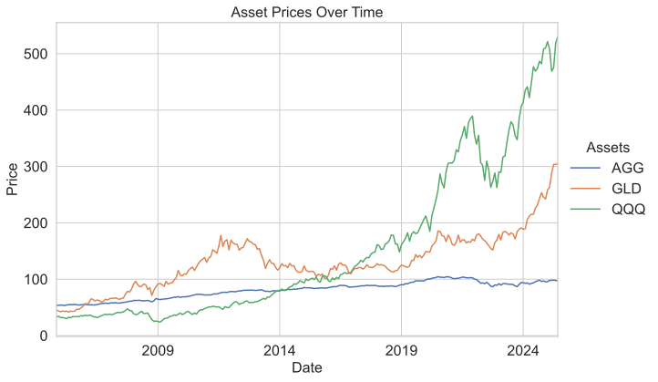
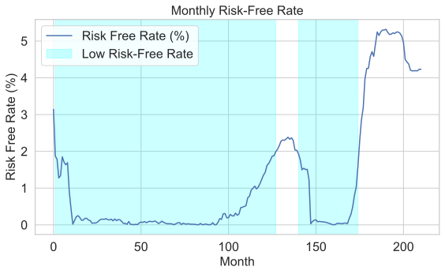
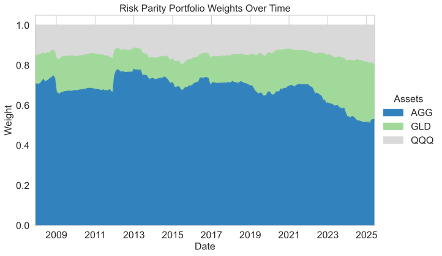
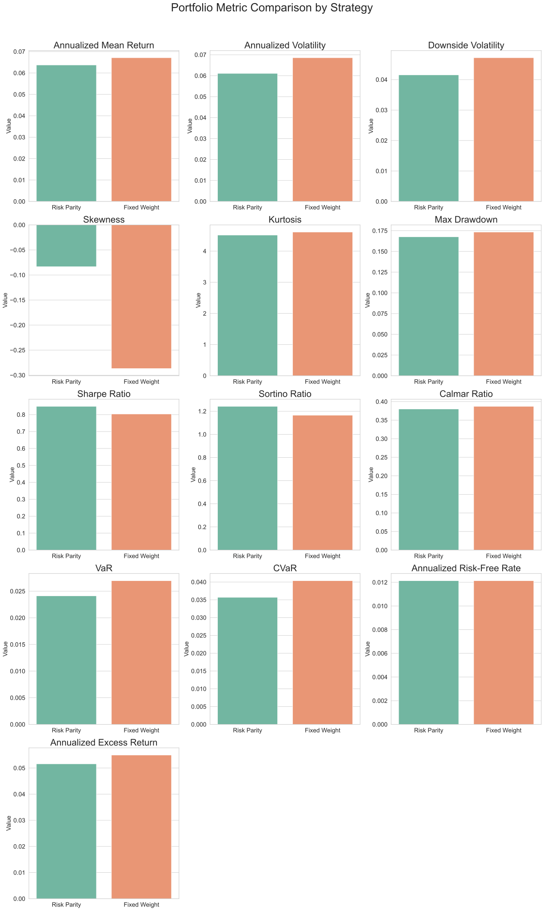

# Evaluating and Backtesting a Dynamic Investment Strategy: Udacity AI Trading Strategies Nanodegree Project

## Background

This repo is a fork of `udacity/CD13641-Project` repo. The parent repo is part of Udacity AI Trading Strategies Nanodegree Course 4: Evaluating Returns and Backtesting. This repo includes Exercises and skeleton Jupyter notebook for project Data Transformation for Trading Models

The key modifications in this fork repo include:
- Updated repo [README](https://github.com/sharan-naribole/finance-data-exploration/blob/main/README.md)
- Completed Project [Jupyter Notebook](https://github.com/sharan-naribole/finance-data-exploration/blob/main/Project/Preparing-for-data-analysis-project-student.ipynb)

---

## 📌 Project Objectives & Expected Outcomes

This project is designed as a learning resource for investors, students, and analysts to **evaluate and backtest dynamic portfolio strategies** using real financial data and Python tools.

**Objectives:**
- Demonstrate the workflow for collecting, preparing, and analyzing asset price data.
- Teach robust risk measurement, return analysis, and dynamic allocation techniques.
- Enable reproducible research with clear Python code and visualizations.

**Expected Outcomes:**
- Practical understanding of constructing, backtesting, and comparing strategies such as Risk Parity and Fixed Weight.
- Hands-on experience with key portfolio metrics and allocation frameworks.
- A reusable template for personal or professional investment research.

---

## ⚙️ Project Dependencies

This project uses the following Python libraries (see `requirements.txt` for full list):

```
pandas==2.0.3
numpy==1.24.4
matplotlib==3.7.5
seaborn==0.13.2
yfinance==0.2.61
```

Install all dependencies with:

```bash
pip install -r requirements.txt
```

---

## 📥 Data Collection

- **Assets Used:** AGG (bonds), GLD (gold), QQQ (tech equities)
- **Source:** Historical daily price data collected using the [`yfinance`](https://github.com/ranaroussi/yfinance) Python package.
- **Risk-Free Rate:**
  - Collected via `yfinance` using the `^IRX` ticker (13-week Treasury Bill rate) or another relevant Treasury yield.
  - Used as a benchmark for excess returns and risk-adjusted metrics (e.g., Sharpe, Sortino ratios).
- **Frequency:** Data is initially collected at daily granularity, then resampled for monthly analysis.



> Above chart highlights the distinct growth and drawdowns of individual assets part of considered portfolio.



> Above chart highlights the periods of low interest rates.

---

## 🧹 Data Preparation for Portfolio Analysis

- **Resampling:**  
  - Asset prices and risk-free rate data are resampled to **monthly frequency** for consistent portfolio evaluation.
  - For the risk-free rate, the last available daily value for each month is used, aligning exactly with portfolio return periods.
- **Volatility Calculation:**  
  Rolling standard deviations (e.g., 36-month window) are computed to estimate each asset’s risk over time.
- **Risk Parity Weights Generation:**  
  Dynamic Risk Parity portfolio weights are calculated such that each asset contributes equally to portfolio risk in each period.

---

## 📊 Portfolio Evaluation

Key performance and risk metrics computed include:

- **Annualized Mean Return:** Compound annual growth rate of the portfolio.
- **Annualized Volatility:** Standard deviation of annualized returns.
- **Downside Volatility:** Standard deviation considering only negative returns.
- **Max Drawdown:** Largest observed peak-to-trough decline.
- **Sharpe Ratio:** Risk-adjusted return above the **monthly risk-free rate**.
- **Sortino Ratio:** Risk-adjusted return considering only downside risk, using the risk-free rate.
- **Calmar Ratio:** Return-to-drawdown efficiency.
- **Value-at-Risk (VaR):** Estimated loss in worst-case scenario at a confidence level.
- **Conditional Value-at-Risk (CVaR):** Average loss in extreme scenarios beyond VaR.
- **Skewness & Kurtosis:** Measures of asymmetry and "fat tail" risk in the return distribution.
- **Excess Return:** Return above the risk-free benchmark.

---

## ⚖️ Example: Risk Parity Analysis



> Above chart highlights the dynamism in risk parity weights over time based on rolling volatility.


> Above chart highlights the periods of low interest rates.

## ⚖️ Example: Fixed Weight vs Risk Parity Comparison

Both a **dynamic (Risk Parity)** and a **static (Fixed Weight)** strategy are implemented and evaluated side-by-side as a learning exercise.

| Metric            | Risk Parity | Fixed Weight |
|-------------------|-------------|--------------|
| Ann. Return       | 6.37%       | **6.71%**    |
| Ann. Volatility   | 6.11%       | 6.86%        |
| Max Drawdown      | **16.8%**   | 17.3%        |
| Sharpe Ratio      | **0.85**    | 0.80         |
| Sortino Ratio     | **1.24**    | 1.17         |
| Calmar Ratio      | 0.38        | **0.39**     |
| VaR               | **2.41%**   | 2.70%        |
| CVaR              | **3.57%**   | 4.04%        |
| Excess Return     | 5.16%       | **5.50%**    |



> Above metrics highlight the higher returns in Fixed Weight at the cost of increased downside volatility.

---

## 📝 Conclusion

- This project walks you through a practical, modern workflow for evaluating and backtesting investment strategies.
- Learn to measure risk, calculate key performance indicators (using the risk-free rate), and visualize results—all with open-source Python tools.
- Use this codebase as a foundation for your own research or portfolio optimization projects.

---

## 🚀 Getting Started

1. **Clone the repo:**
   ```bash
   git clone https://github.com/yourusername/your-repo-name.git
   ```
2. **Install dependencies:**
   ```bash
   pip install -r requirements.txt
   ```
3. **Open and run the notebook:**
   - Launch `Project.ipynb` in Jupyter Notebook and follow the analysis step-by-step.

---

## License

[License](LICENSE.txt)